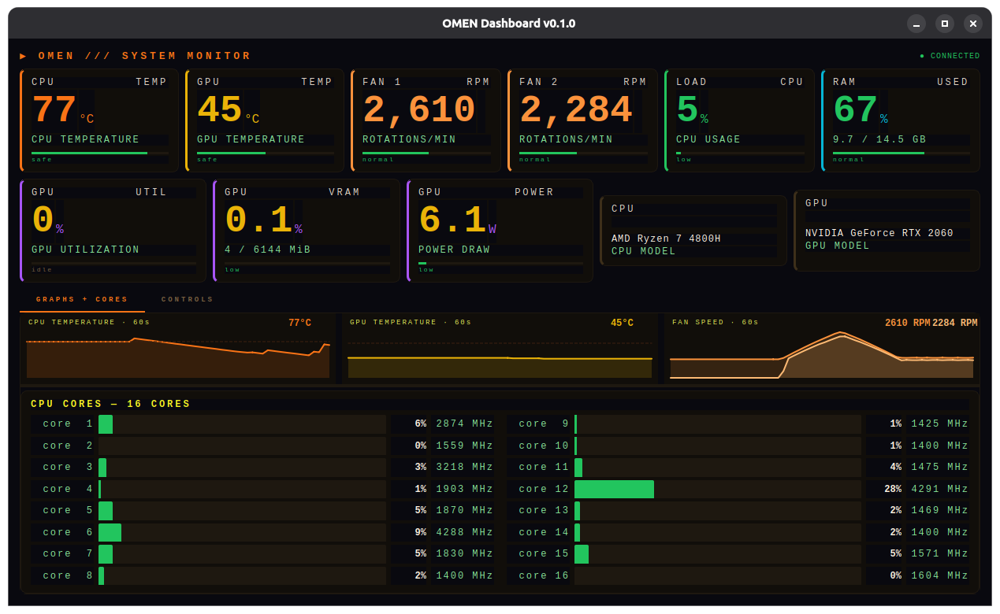
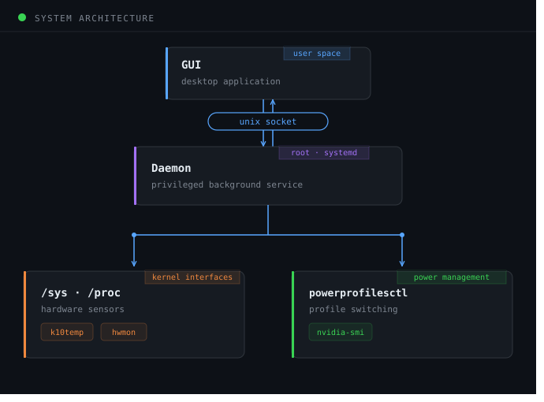

# OMEN Fan Control

[](https://github.com/AbdulRahman2257/omenfancontrol/actions/workflows/ci.yml)
[](https://github.com/AbdulRahman2257/omenfancontrol/releases)
[]()
[](https://www.python.org)
[]()
[](LICENSE)
[](https://github.com/psf/black)
[](https://www.riverbankcomputing.com/software/pyqt)
[](https://github.com/AbdulRahman2257/omenfancontrol/pulls)

Fan control and thermal monitoring dashboard for HP OMEN laptops on Linux. Replaces OMEN Hub. No third-party dependencies — uses Linux kernel interfaces directly.



---

## Requirements

| | |
|---|---|
| OS | Ubuntu 22.04+ |
| Python | 3.11+ (source install only) |
| power-profiles-daemon | pre-installed on Ubuntu 22.04+ |
| nvidia-smi | optional — NVIDIA GPU metrics |

The `hp-wmi` kernel module must be loaded. Verify: `lsmod | grep hp_wmi`

---

## Install

**.deb (recommended)**
```bash
sudo apt install ./omenfancontrol_0.1.0_amd64.deb
```

**PyInstaller binary**
```bash
tar -xzf omenfancontrol-0.1.0-linux-x86_64.tar.gz
cd omenfancontrol-0.1.0
sudo bash install.sh
```

**Source**
```bash
git clone https://github.com/AbdulRahman2257/omenfancontrol.git
cd omenfancontrol
sudo bash install/install.sh
```

---

## Usage

```bash
omenfancontrol          # launch GUI
```

The daemon runs as a systemd service and starts on boot.

```bash
systemctl status omenfancontrol
journalctl -u omenfancontrol -f
sudo systemctl restart omenfancontrol
```

**Thresholds**

| Key | Default | Behaviour |
|-----|---------|-----------|
| CPU warn | 85°C | alert |
| CPU critical | 90°C | alert + fan → MAX |
| CPU recover | 75°C | fan → AUTO |
| GPU warn | 80°C | alert |
| GPU critical | 90°C | alert |

Changes take effect immediately and persist across restarts.

---

## Kernel interfaces

```
fan control    → /sys/devices/platform/hp-wmi/hwmon/hwmon5/pwm1_enable
                 0 = MAX  |  2 = AUTO (BIOS)

power profiles → powerprofilesctl
                 performance  |  balanced  |  power-saver

fan RPM        → hwmon5/fan1_input, fan2_input
CPU temp       → k10temp/temp1_input
GPU metrics    → nvidia-smi
```

---

## Architecture




---

## Project structure

```
omenfancontrol/
├── daemon/
│   ├── alerter.py       threshold watcher
│   ├── commander.py     kernel interface — fan + power
│   ├── daemon.py        orchestrator
│   ├── ipc_server.py    Unix socket server
│   └── reader.py        /sys, /proc, nvidia-smi
├── gui/
│   ├── panels/          metrics, graphs, controls
│   ├── styles/dark.qss  theme
│   ├── ipc_client.py    Qt socket client
│   ├── main_window.py   window assembly
│   ├── notifier.py      desktop notifications
│   └── tray.py          system tray
├── install/
│   ├── debian/          .deb control files
│   ├── install.sh       source installer
│   ├── install_binary.sh PyInstaller installer
│   └── uninstall.sh     removal
├── tests/               pytest suite
├── .github/workflows/   ci, readme, release
├── config.py
├── models.py
├── thresholds.py
├── main.py
└── pyproject.toml
```

---

## Development

```bash
python3.11 -m venv .venv && source .venv/bin/activate
pip install PyQt6 pytest pytest-cov black flake8
```

```bash
# run tests
python -m pytest tests/ -v -m "not integration"

# format + lint
black . && flake8 .

# run daemon
sudo python -m daemon.daemon

# run GUI
python main.py
```

```bash
# build packages locally
bash build_deb.sh
bash build_pyinstaller.sh
```

---

## Release

```bash
# bump version in pyproject.toml and config.py, then:
git tag vx.y.z
git push origin main --tags
```

CI builds and publishes `.deb`, PyInstaller tarball, and source automatically.

---

## Compatible hardware

| Device | CPU | GPU | Status |
|--------|-----|-----|--------|
| HP OMEN 15 en0xxx | AMD Ryzen 7 4800H | NVIDIA RTX 2060 | ✅ tested |
| Other OMEN models | — | — | ❓ untested |

Open an issue if you test on another model.

---

## Contributing

Open an issue before submitting a large PR.

Areas where contributions are welcome:

- Other HP OMEN / Victus models
- Intel CPU support (`coretemp` driver)
- AMD GPU support

---

## License

[GPL-3.0](LICENSE) — required by PyQt6.

---

## Disclaimer

Not affiliated with or endorsed by HP Inc. "OMEN" is a trademark of HP Inc., referenced here solely for device identification. Use at your own risk. Modifying fan behaviour may void your warranty.